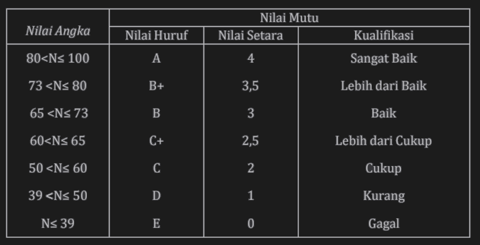
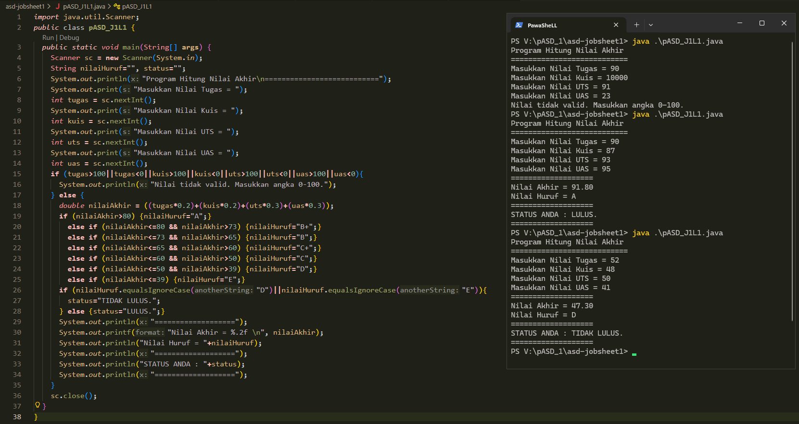
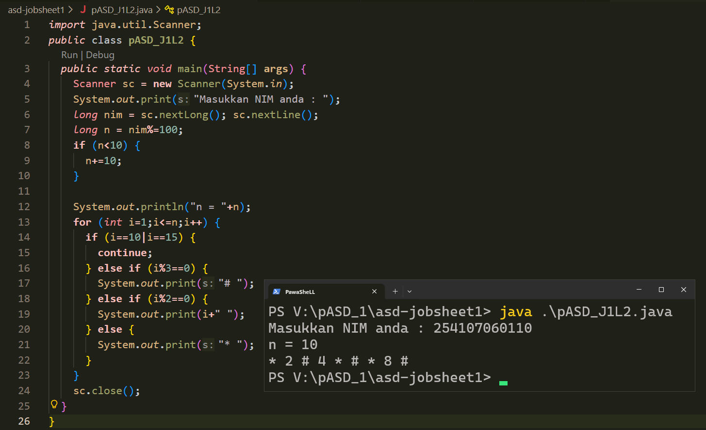
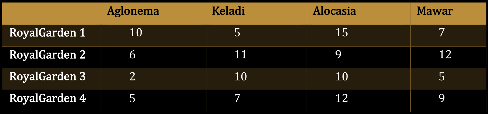

# [Tugas](#tugas-1)  
# [Daftar_Percobaan](#daftar_percobaan-1)  

# TUGAS
  
### TUGAS 1    
Soal : 
Susun program untuk membuat dua buah array berikut isinya sebagai berikut. Array pertama adalah array satu dimensi char KODE[10], berisi kode plat mobil. Array kedua, array dua dimensi char KOTA[10][12] berisi nama kota yang berpasangan dengan kode plat mobil.
Ketika pengguna memberikan input kode plat nomor maka program akan mengeluarkan nama kota dari kode plat nomor tersebut.
```
+---+   +---+---+---+---+---+---+---+---+---+---+---+---+---+---+
| A |   | B | A | N | T | E | N |   |   |   |   |   |   |   |   |
+---+   +---+---+---+---+---+---+---+---+---+---+---+---+---+---+
| B |   | J | A | K | A | R | T | A |   |   |   |   |   |   |   |
+---+   +---+---+---+---+---+---+---+---+---+---+---+---+---+---+
| D |   | B | A | N | D | U | N | G |   |   |   |   |   |   |   |
+---+   +---+---+---+---+---+---+---+---+---+---+---+---+---+---+
| E |   | C | I | R | E | B | O | N |   |   |   |   |   |   |   |
+---+   +---+---+---+---+---+---+---+---+---+---+---+---+---+---+
| F |   | B | O | G | O | R |   |   |   |   |   |   |   |   |   |
+---+   +---+---+---+---+---+---+---+---+---+---+---+---+---+---+
| G |   | P | E | K | A | L | O | N | G | A | N |   |   |   |   |
+---+   +---+---+---+---+---+---+---+---+---+---+---+---+---+---+
| H |   | S | E | M | A | R | A | N | G |   |   |   |   |   |   |
+---+   +---+---+---+---+---+---+---+---+---+---+---+---+---+---+
| L |   | S | U | R | A | B | A | Y | A |   |   |   |   |   |   |
+---+   +---+---+---+---+---+---+---+---+---+---+---+---+---+---+
| N |   | M | A | L | A | N | G |   |   |   |   |   |   |   |   |
+---+   +---+---+---+---+---+---+---+---+---+---+---+---+---+---+
| T |   | T | E | G | A | L |   |   |   |   |   |   |   |   |   |
+---+   +---+---+---+---+---+---+---+---+---+---+---+---+---+---+
```

Jawaban :   

---  

### TUGAS 2    
Soal : 
Sebuah program digunakan untuk menyimpan dan mengelola jadwal kuliah mahasiswa. Data jadwal disimpan dalam array 2 dimensi bertipe string, dengan ketentuan:
- Baris menyatakan jadwal ke-i
- Kolom menyatakan informasi jadwal: Nama Mata Kuliah, Ruang, Hari Kuliah, Jam Kuliah. Contoh : 
```
jadwal[0][0] = "Pemrograman Dasar"
jadwal[0][1] = "Lab Komputasi 1"
jadwal[0][2] = "Senin"
jadwal[0][3] = "08.00–10.00"
```
- Jumlah jadwal kuliah sebanyak n, diinputkan oleh pengguna.

Buatkan fungsi untuk:
a. Menginput data jadwal kuliah ke dalam array 2 dimensi
b. Menampilkan seluruh jadwal kuliah dalam bentuk tabel
c. Menampilkan jadwal kuliah berdasarkan hari tertentu
d. Menampilkan jadwal kuliah berdasarkan nama mata kuliah tertentu
  
Jawaban :   


---  


# Daftar_Percobaan
1. [Percobaan 1](#percobaan-1)
- [Pertanyaan](#pertanyaan)
    * [Jawaban](#jawaban)
2. [Percobaan 2](#percobaan-2)
- [Pertanyaan](#pertanyaan-1)
    * [Jawaban](#jawaban-1)
3. [Percobaan 3](#percobaan-3)
- [Pertanyaan](#pertanyaan-2)
    * [Jawaban](#jawaban-2)
4. [Percobaan 4](#percobaan-4)
- [Pertanyaan](#pertanyaan-3)
    * [Jawaban](#jawaban-3)


---

## Percobaan 1
[Kembali ke #Daftar_Percobaan](#daftar_percobaan-1)

### Pertanyaan
1. Buatlah program untuk menghitung nilai akhir dari mahasiswa dengan ketentuan 20% nilai tugas, 20% dari nilai kuis, 30% nilai UTS, dan 30% nilai UAS. Setiap nilai yang dimasukkan mempunyai batas nilai 0 - 100. Ketika pengguna memasukkan di luar rentang tersebut maka akan keluar output “nilai tidak valid”. Ketika nilai akhir sudah didapatkan selanjutnya lakukan konversi nilai dengan ketentuan yang ada pada tabel.   
Jika Nilai Huruf yang didapatkan adalah A, B+, B, C+, C maka LULUS, jika nilai huruf D dan E maka TIDAK LULUS.

   
[Kembali ke #Daftar_Percobaan](#daftar_percobaan-1)

### Jawaban
[File Java Percobaan/Latihan 1 | pASD_J1L1](pASD_J1L1.java)
  
  [Kembali ke #Daftar_Percobaan](#daftar_percobaan-1)

---

## Percobaan 2
  
[Kembali ke #Daftar_Percobaan](#daftar_percobaan-1)

### Pertanyaan
1. Buatlah program yang dapat menampilkan deretan bilangan dari angka 1 sampai n, dengan n = 2-digit terakhir NIM Anda.  
Berikut Adalah ketentuan untuk mencetak deretnya:  
a. Bilangan kelipatan 3 dicetak dengan simbol #  
b. Bilangan genap selain kelipatan 3 dicetak sesuai angkanya  
c. Bilangan ganjil dicetak dengan simbol *  
d. Bilangan 10 dan 15 tidak dicetak  
*bila n<10 maka tambahkan 10 (n+=10)  
Contoh 1: Input NIM: 2541720102 maka n=12, Output: `* 2 # 4 * # * 8 # * #`  
Contoh 2: Input NIM: 2541720120 maka n=20 Output: `* 2 # 4 * # * 8 # * # * 14 16 * # * 20`

[Kembali ke #Daftar_Percobaan](#daftar_percobaan-1)

### Jawaban
[File Java Percobaan/Latihan 2 | pASD_J1L2.java](pASD_J1L2.java)
  

[Kembali ke #Daftar_Percobaan](#daftar_percobaan-1)

---

## Percobaan 3  
  
[Kembali ke #Daftar_Percobaan](#daftar_percobaan-1)

### Pertanyaan
1. Buatlah program untuk menghitung IP Semester dari mata kuliah yang Anda tempuh semester lalu. Formula untuk menghitung IP semester sebagai berikut:  
`IP Semester = Σ (Nilai Setara * bobot SKS) / Σ SKS`  
Nilai setara didapatkan dari tabel konversi berikut ini.  

Input dari program berupa **nama mata kuliah**, **bobot SKS**, serta **nilai huruf** dari mata kuliah tersebut.

[Kembali ke #Daftar_Percobaan](#daftar_percobaan-1)

### Jawaban

  
[Kembali ke #Daftar_Percobaan](#daftar_percobaan-1)

---

## Percobaan 4  
  
[Kembali ke #Daftar_Percobaan](#daftar_percobaan-1)

### Pertanyaan
1. RoyalGarden adalah toko bunga yang memiliki banyak cabang. Setiap hari Stock Bunga dan bunga-bunga yang dijual selalu dicatat dengan rincian sebagai berikut ini  

Rincian Harga Aglonema =75.000, Keladi = 50.000, Alocasia =60.000, Mawar =10.000.  
Buatlah fungsi untuk menampilkan pendapatan setiap cabang jika semua bunga habis terjual.
2. Tampilkan status dari setiap cabang dengan ketentuan sebagai berikut ini :  
a. Jika pendapatan cabang > Rp1.500.000, maka cabang tersebut mendapat status “Sangat Baik”   
b. Jika pendapatan ≤ Rp1.500.000, status “Perlu Evaluasi”.

[Kembali ke #Daftar_Percobaan](#daftar_percobaan-1)

### Jawaban
  
[Kembali ke #Daftar_Percobaan](#daftar_percobaan-1)

---
